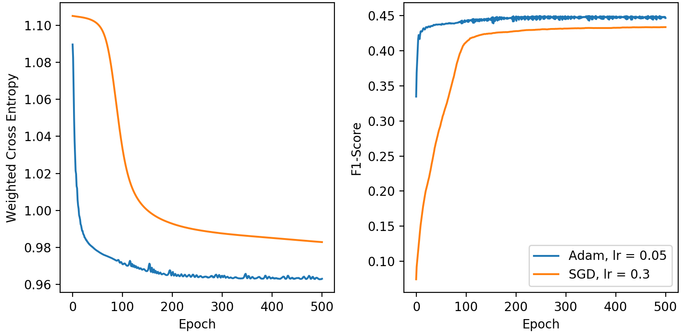
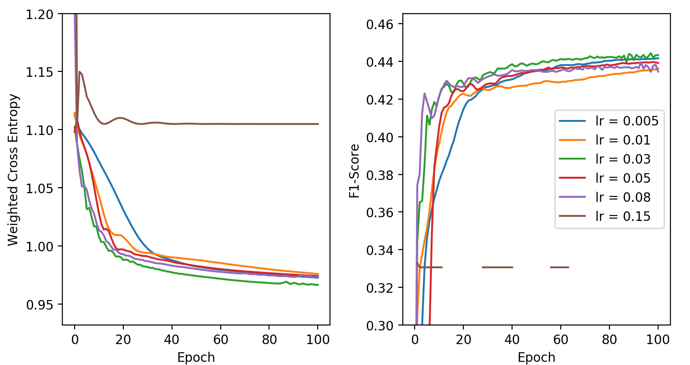
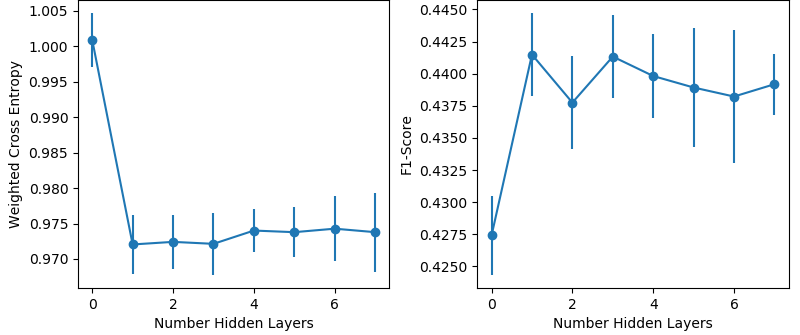
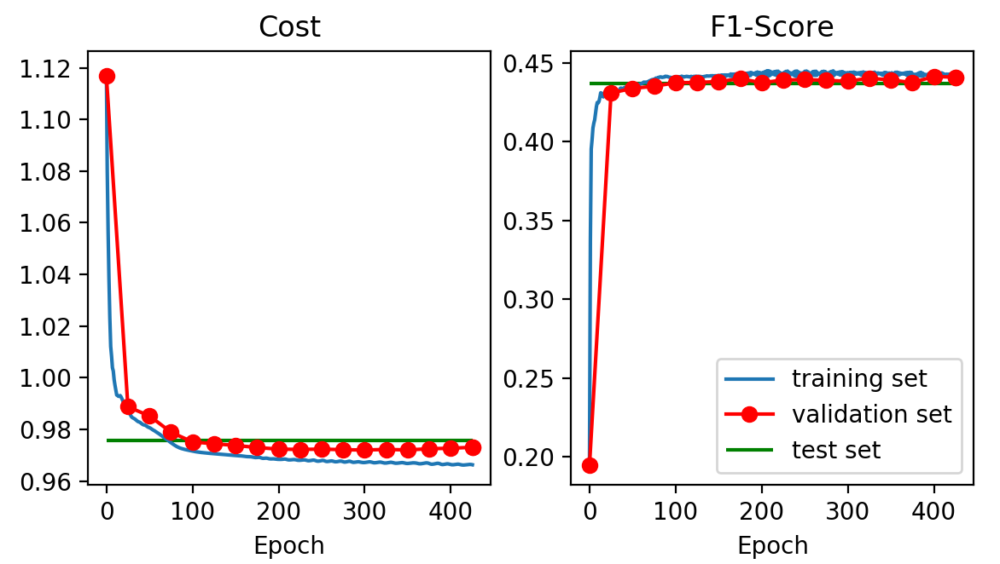
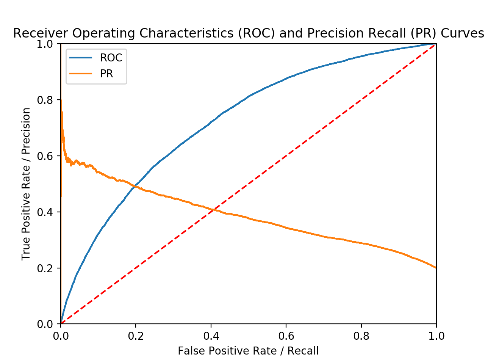

### Predicting no-shows for hospital appointments

Prediction of no-shows for hospital appointments based on electronic medical record (EMR) 
using Logistic Regression and fully-connected Neural Networks. 

Implemented using TensorFlow.

Model implemented in [Code/NN_sigmoid.py](https://github.com/mcreduardo/No_Show/blob/master/Code/NN_sigmoid.py). An usage example can be found at the end of the file.

### Dataset

The dataset was provided by a healthcare software company. In order to protect patient privacy, some features were not provided or replaced by dummy variables. This places a limitation to the trained models.

If all data was available (e.g. location and date), other cirscuntancial data (e.g. weather, public transportation availability) could have been used.

It is important to notice that, for a model like this one, it is essential to pay attention on Fairness. Some features might introduce unfair bias to the model. For example, the usage of social economic related data could result in a model that will be unfair towards people of lower income.

### Model

Fully-connected Neural Network with Sigmoid activation

* Fully connected layers with ReLU activation;
* Sigmoid activation;
* Optimizers:

   Stochastic Gradient Descent  
   Adam
* Loss:

   Cross entropy  
   Weighted cross entropy: the data set used is binary with a 80/20 ratio  
* Early stopping based on validation set implemented to avoid overfitting.

### Usage

```python
class NN_Sigmoid:
    """
    Simple NN for binary classification using Sigmoid function.
    Fully connected layers with ReLU activation.
    """

    def __init__(
        self, hiddenLayers, numFeatures, numLabels, learning_rate, 
        cross_entropy_weight = 1,
        optimizer = "GD"
    )
         """
        Constructor: Build network

        "hiddenLayers" contains the structure of the network to be trained:
            list with number of neurons per hidden layer.

        "numFeatures" is the number of features

        "numLabels" is the number of labels

        "learning_rate" is the learning rate used for training

        "cross_entropy_weight" tf.nn.weighted_cross_entropy_with_logits if != 1

        "optimizer" method used to minimize cost. Values: "GD" (gradient descent, default) or "Adam"
        """

   def train(
        self, numEpochs, trainX, trainY, 
        valX=None, valY=None, val_epochs=None, val_patience=None
    )
        """
        Train NN on features "trainX" an labels "trainY".

        "numEpochs" is the number of training epochs.
        
        "valX" and "valY" is the validation set.

        "val_epochs" is the number of epochs between each training evaluation.

        "val_patience" is the number of times that the loss on the validation 
        set can be larger than or equal to the previously smallest loss before 
        network training stops. 
        """

        return acc_history, f1_history, cost_history, val_acc_history,\
            val_f1_history, val_cost_history, val_epoch
   
   def predict(self, testX, testY)
         """
        Predict based on "testX".
        
        evaluate based on "testY".
        """

        return predicted, loss, acc, f1
```

### Results

Optimizers comparison:  


Learning rates for Adam comparison:  


Depth comparison with 10-fold cross validation (overfitting occur):  


Training:    
* 1 hidden layer with 10 units   
* Optimizer = Adam with learning rate of 0.05     
 

Results:  
* F1-Score = 0.441  
* AUC of ROC = 0.725  
* Precision = 0.335  
* Recall = 0.639  
* Accuracy = 0.681  


ROC and PR curves:    
  

